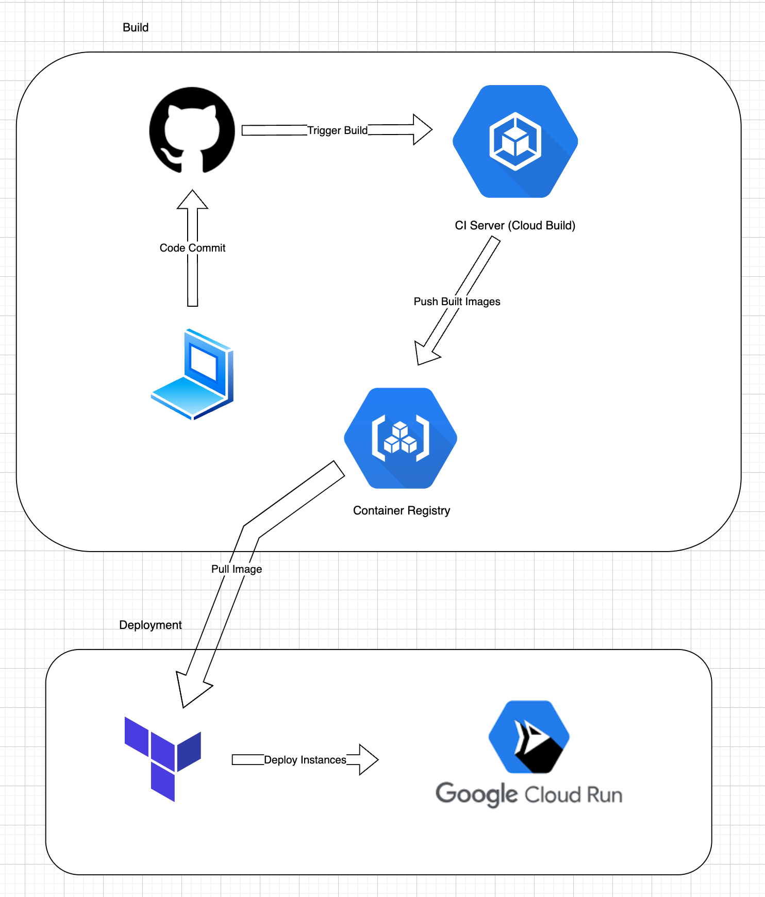
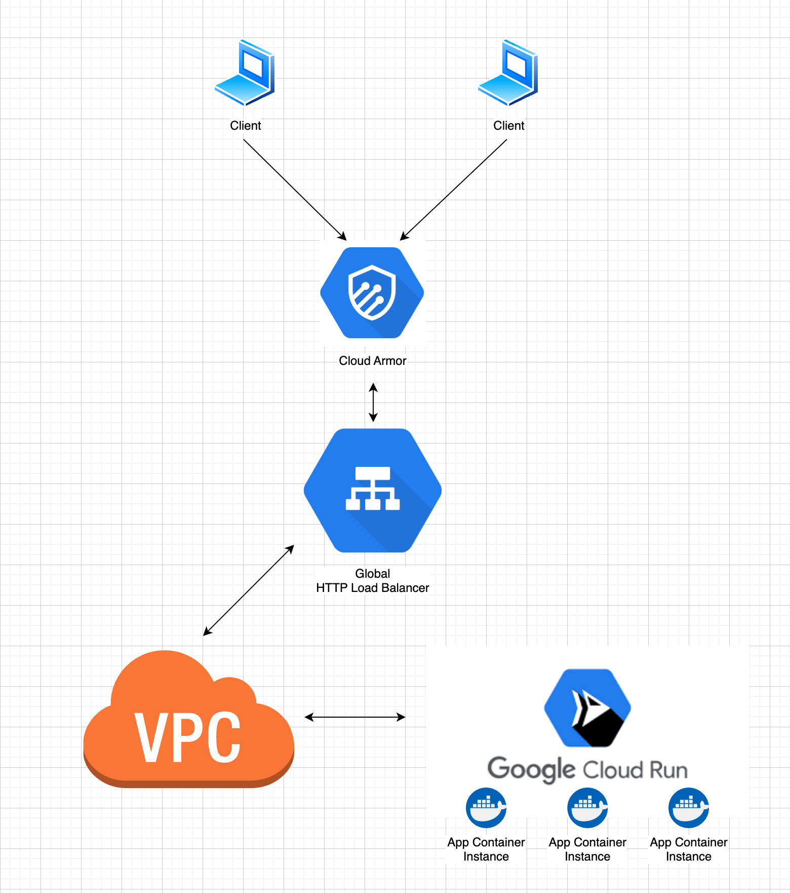

# Deploying a Containerised Flask Application in GCP

This project demonstrates how to deploy a containerised flask application to GCP. 

The solution involves the following:
1. Infrastructure-as-Code (Terraform) to provision the GCP infrastructure.
2. Cloud Build pipeline to build a Docker image, push it to the GCP registry and deploy to Cloud Run. 

The cloud run service will be exposed via an External HTTPS Load Balancer to enable us to route traffic via the VPC network and utilise additional GCP services like Cloud CDN and Cloud Armor.

## Pre-requisites
1. A GCP project with billing enabled
2. Terraform CLI (https://developer.hashicorp.com/terraform/downloads)
3. gcloud CLI (https://cloud.google.com/sdk/docs/install). Configure with `gcloud init` and `gcloud auth application-default login`
4. A registered domain for provisioning SSL certificates
5. Update the `terraform.tfvars` file with your own configuration

## Architecture - CI/CD

We will use Cloud Build as our Continuous Integration (CI) server to manage container builds for us as well as run any tests such as unit/integration tests, static code analysis, etc. We will also use Google Artifact Registry to host our container image registry. 

In practice, we should connect Cloud Build to GitHub using the Cloud Build Github App to automatically trigger builds on commits/PR's. 

Furthermore, the Continuous Delivery (CD) part of this architecture will be managed by Terraform. There are probably better options nowadays worth exploring, such as GitOps tools like ArgoCD/Flux, or GCP's native/managed solution - Cloud Deploy.

## How to build the containerised Flask application
1. Go to the app directory 
2. Go to IAM and grant the Cloud Build Service Account `Cloud Run Admin` and `Service Account User` roles.
3. Run the following: 
`gcloud builds submit --config cloudbuild.yaml --substitutions=REPO_NAME="flask-app-test",_REGION="australia-southeast1"`. This triggers the pipeline as defined in `cloudbuild.yaml`.

## Architecture - Infrastructure

We will use Cloud Run, which is a managed platform that automatically scales containers. There will be a VPC serverless connector connecting it to our VPC and fronted by an HTTP Load Balancer. This enforces all traffic to the application to pass through the VPC instead of the public internet, hence providing additional security controls (e.g. firewall rules). 

We will also implement Cloud Armor to provide security at the edge and to help provide built-in defense against L3 and L4 DDoS attacks as well as Web Application Firewall. 

## How to provision the infrastructure
1. Go to the terraform directory
2. Run `terraform init` to initialise the working directory
3. Provision the GCP resources using `terraform fmt/validate/plan/apply`
4. Once terraform completes, it will output the public IP address of the load balancer. Setup an `A record` on your DNS service for the domain in the tfvars file and this IP address. In a production environment this should be handled by Terraform on Cloud DNS or similar. 
5. Certificate provisioning may take up to an hour to complete. Monitor this in [Certificate Manager](https://cloud.google.com/certificate-manager/docs/overview)

## Shutting down the infrastructure
1. Go to the terraform directory
2. Run `terraform destroy` and review the resources before proceeding.
